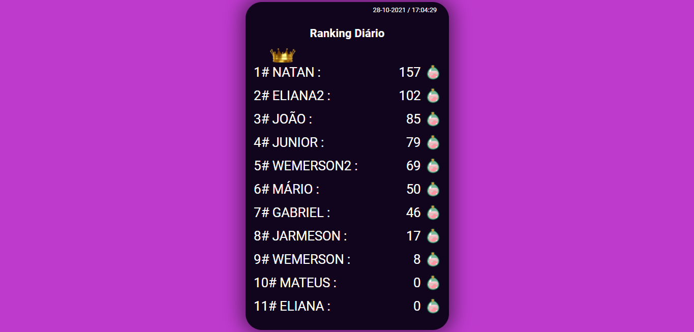
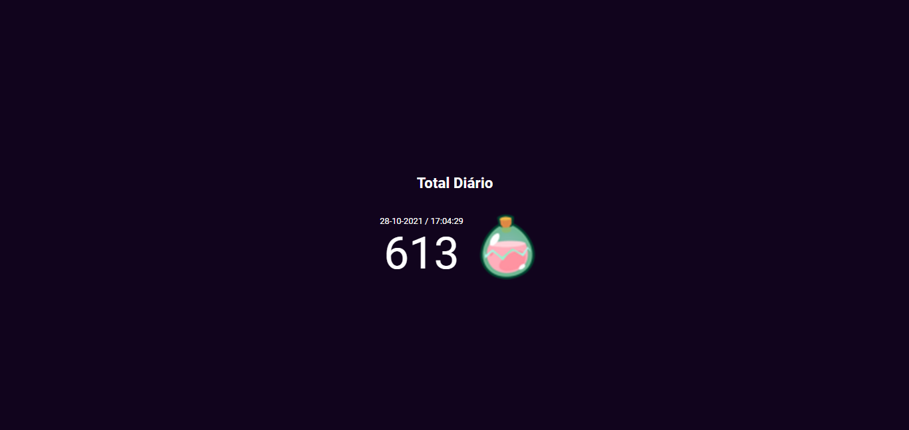

<h1 align="center">
  <a href="https://leonardopess.github.io/Ranking-Diario/">
    Ranking Diário
  </a>
</h1>

<b>Ranking Diário</b> foi desenvolvido com HTML, CSS E JAVASCRIPT, fazendo a listagem dos jogadores com mais ponto para os que tem menos e mostrando junto com a data da atualização de forma dinâmica e na página total ele junta os pontos de todos jogadores e soma para ser monstado o total em tela junto com a data de atualização! Todas informações vindas de uma API (neste projeto eu alterei para um json estático).

   
  
  

  

  

  

  
  

Um projeto simples, porém tentei deixar algo bem clean e de fácil entendimento para qualquer um que acessar o código!

## Demo
https://leonardopess.github.io/Ranking-Diario/
